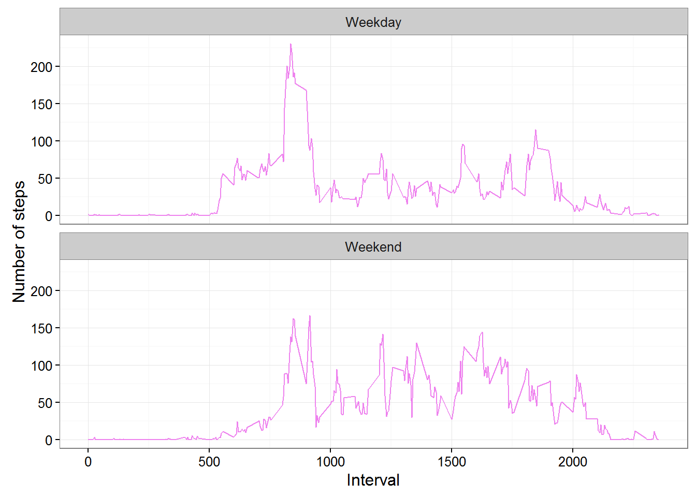

## Loading and preprocessing the data

Download, unzip and load data into data frame `data`. 
```{r}
if(!file.exists("getdata-projectfiles-UCI HAR Dataset.zip")) {
    temp <- tempfile()
    download.file("https://d396qusza40orc.cloudfront.net/repdata%2Fdata%2Factivity.zip",temp)
    unzip(temp)
    unlink(temp)
}

data <- read.csv("activity.csv")
```


## What is mean total number of steps taken per day?
Sum steps by day, create Histogram, and calculate mean and median.
```{r} 
steps_by_day <- aggregate(steps ~ date, data, sum)

library(ggplot2)
ggplot(steps_by_day, aes(x = steps)) + 
    geom_histogram(fill = "green", binwidth = 1000) + 
    labs(title="Histogram of Steps Taken per Day", 
         x = "Number of Steps per Day", y = "Number of times in a day(Count)") + theme_bw()
```


```{r}
rmean <- mean(steps_by_day$steps, na.rm = TRUE)
rmedian <- median(steps_by_day$steps, na.rm = TRUE)
```

The mean is **10766.19** and median is **10765.00**

## What is the average daily activity pattern?

* Calculate average steps for each interval for all days. 
* Plot the Average Number Steps per Day by Interval. 
* Find interval with most average steps.

```{r}
steps_by_interval <- aggregate(steps ~ interval, data, mean)

plot(steps_by_interval$interval,
     steps_by_interval$steps, type="l", xlab="Interval", ylab="Number of Steps",
     main="Average Number of Steps per Day by Interval")

max_interval <- steps_by_interval[which.max(steps_by_interval$steps),1]
```


The 5-minute interval, on average across all the days in the data set, containing the maximum number of steps is **835**.

## Impute missing values.
Replace missing values with the mean value at the same interval across days.

#### 1. Calculate and report the total number of missing values in the dataset
```{r}
missing_vals <- sum(is.na(data$steps))
print(missing_vals)
```
#### 2. Strategy for filling in all of the missing values in the dataset.
We choose to replace missing values with the mean value at the same interval across days.
```{r}
na_fill <- function(data, pervalue) {
    na_index <- which(is.na(data$steps))
    na_replace <- unlist(lapply(na_index, FUN=function(idx){
        interval = data[idx,]$interval
        pervalue[pervalue$interval == interval,]$steps
    }))
    fill_steps <- data$steps
    fill_steps[na_index] <- na_replace
    fill_steps
}

data_fill <- data.frame(  
    steps = na_fill(data, steps_by_interval),  
    date = data$date,  
    interval = data$interval)
```
We check that are there any missing values remaining or not
```{r}
sum(is.na(data_fill$steps))
```
#### 3. A histogram of the total number of steps taken each day
```{r}
fill_steps_per_day <- aggregate(steps ~ date, data_fill, sum)
colnames(fill_steps_per_day) <- c("date","steps")

##plotting the histogram
ggplot(fill_steps_per_day, aes(x = steps)) + 
    geom_histogram(fill = "blue", binwidth = 1000) + 
    labs(title="Histogram of Steps Taken per Day", 
         x = "Number of Steps per Day", y = "Number of times in a day(Count)") + theme_bw()
```


#### 4. Calculate new mean and median for imputed data.
```{r}
steps_mean_fill   <- mean(fill_steps_per_day$steps, na.rm=TRUE)
steps_median_fill <- median(fill_steps_per_day$steps, na.rm=TRUE)
```

* Do these values differ from the estimates from the first part of the assignment?

    * Before filling the data

        * Mean : **10766.19**
    
        * Median: **10765.00**
    
    * After filling the data

        * Mean : **10766.19**
    
        * Median: **10766.19**
        
* What is the impact of imputing missing data on the estimates of the total daily number of steps?

    We observe that while the mean value remains unchanged, the median value has shifted and virtual matches to the mean.

## Are there differences in activity patterns between weekdays and weekends?
Created a plot to compare and contrast number of steps between the week and weekend. There is a higher peak earlier on weekdays, and more overall activity on weekends.  
``` {r}
weekdays <- c("Monday", "Tuesday", "Wednesday", "Thursday", "Friday")
data_fill$dow = as.factor(ifelse(is.element(weekdays(as.Date(data_fill$date)),weekdays), 
                                 "Weekday", 
                                 "Weekend"))

steps_by_interval_i <- aggregate(steps ~ interval + dow, data_fill, mean)

ggplot(steps_by_interval_i, aes(x=interval, y=steps)) + 
    geom_line(color="violet") + 
    facet_wrap(~ dow, nrow=2, ncol=1) +
    labs(x="Interval", y="Number of steps") +
    theme_bw()
```
